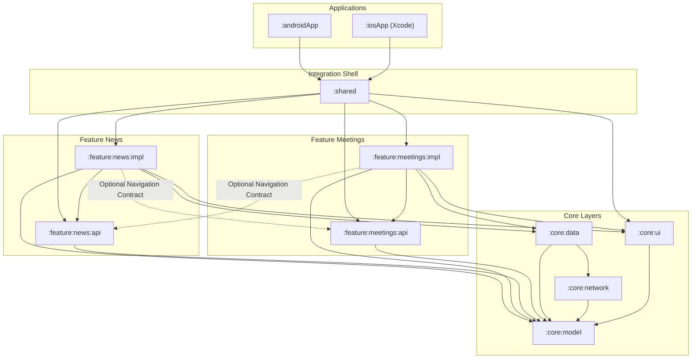

# Technical Architecture: Modularization & Feature API/Impl Pattern

## 1. Multi-Module Hierarchy with API/Impl Separation

The repository strictly enforces the **Feature API & Implementation (`api` / `impl`) Pattern**. Every functional domain is split into a public contract module (`:api`) and a private implementation module (`:impl`).

This architecture delivers:
- **Zero Circular Dependencies**: Features communicate strictly via contracts, never via implementations.
- **Optimized Build Performance**: Changes in an `:impl` module do not invalidate dependent modules because dependents compile against the unchanging `:api`.
- **Enforced Encapsulation**: Private ViewModels, internal composables, and business logic cannot accidentally leak across feature boundaries.



---

## 2. Anatomy of a Feature: `:api` vs. `:impl`

### Feature API (`:feature:<name>:api`)
- **Nature**: Lightweight contract module (pure Kotlin or minimal Compose dependencies).
- **Contents**:
  - **Navigation Routes / Destinations**: Type-safe destination objects, arguments, or deep link contracts.
  - **Public Entry Point Contracts**: Interface definitions for the feature screen or widget entry points (e.g., `NewsFeatureEntry`).
  - **Public Events**: Events that other modules can trigger or consume.
- **Rule**: Fast compiling. Has **zero** references to private ViewModels, internal screens, or heavy data implementations.

### Feature Implementation (`:feature:<name>:impl`)
- **Nature**: Heavyweight implementation module.
- **Contents**:
  - Implements the contract defined in `:api`.
  - Private ViewModels (`NewsViewModel`), private state models (`NewsUiState`), and business logic.
  - Internal Composables (`NewsScreen`, `NewsCard`, `NewsFilterRow`).
  - Dependency Injection wiring (e.g. Koin feature module or factory bindings).
- **Rule**: Marked internal where possible. **No other feature is ever permitted to depend on an `:impl` module.** Only `:shared` depends on `:impl`.

---

## 3. Cross-Feature Communication Pattern

When **Feature A** needs to trigger or navigate to **Feature B**:

1. `:feature:A:impl` adds a Gradle dependency **only** on `:feature:B:api`:
   ```kotlin
   // In feature/news/impl/build.gradle.kts
   dependencies {
       implementation(projects.feature.meetings.api) // Allowed!
       // implementation(projects.feature.meetings.impl) // FORBIDDEN!
   }
   ```
2. The destination or contract from `:feature:B:api` is used:
   ```kotlin
   // In feature:meetings:api
   interface MeetingsNavigator {
       fun openMeetingDetail(meetingId: String)
   }
   ```
3. The concrete navigation is executed either directly via contract injection or resolved at the `:shared` orchestration layer.

---

## 4. Module Directory Structure & Responsibilities

| Gradle Module | Type | Role |
| :--- | :--- | :--- |
| `:androidApp` | Android App | Android application entry point (`MainActivity.kt`). |
| `:iosApp` | iOS Xcode | SwiftUI application entry point (`ContentView.swift`). |
| `:shared` | KMP Library | App integration shell, orchestrates bottom navigation, DI graph, and exports iOS framework. |
| `:feature:news:api` | KMP Library | Public API, navigation contracts, and entry definitions for News. |
| `:feature:news:impl` | KMP Library (Compose) | Full News UI, NewsViewModel, and internal components. |
| `:feature:meetings:api` | KMP Library | Public API, navigation contracts, and entry definitions for Meetings. |
| `:feature:meetings:impl` | KMP Library (Compose) | Full Meetings UI, MeetingsViewModel, and internal components. |
| `:core:model` | Pure KMP | Pure domain entities (`NewsArticle`, `Meeting`). No UI/Android dependencies. |
| `:core:network` | KMP Library | Ktor HTTP Client, MockEngine, JSON mock assets, and DTOs. |
| `:core:data` | KMP Library | Repository interfaces and implementations, data mapping. |
| `:core:ui` | KMP Library (Compose) | Schwarz design system, theme, typography, colors, and reusable UI tokens. |

---

## 5. Strict Boundary Enforcement

1. **API / Impl Segregation**:
   - `Feature X (impl)` may depend on `Feature Y (api)`.
   - `Feature X (impl)` must **NEVER** depend on `Feature Y (impl)`.
   - `Feature X (api)` must **NEVER** depend on any `Feature (impl)` and should rarely depend on another `Feature (api)`.
2. **Domain Layer Independence**:
   - `:core:model` remains completely isolated from UI, Compose, and network libraries.
3. **Encapsulated Data Access**:
   - Feature implementations access data only through repositories in `:core:data`, never by making raw network calls to `:core:network`.
