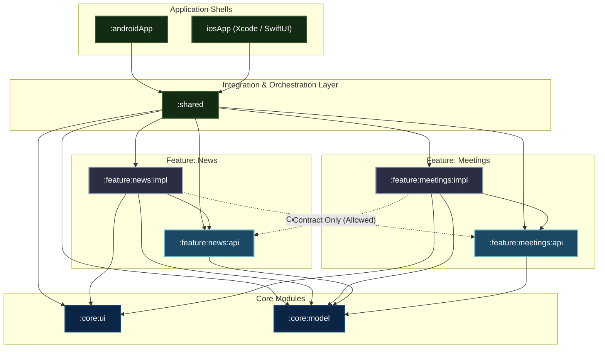

# Schwarz Mobile Community

[](https://kotlinlang.org/docs/multiplatform.html)
[](https://www.jetbrains.com/lp/compose-multiplatform/)
[](https://developer.android.com/)
[](#)

A modern, production-grade **Kotlin Multiplatform (KMP)** and **Compose Multiplatform** application designed for the mobile development community across **Schwarz Digits** (Lidl, Kaufland, STACKIT, XM Cyber).

The application connects engineers across organizations by providing a centralized hub for engineering news, architecture updates, tech articles, and upcoming community meetings.

---

## 🏛️ Modular Architecture: Feature API & Impl Pattern

The project strictly follows a **modular architecture** organized around clean separation of concerns and the **Feature API & Implementation (`api` / `impl`) Pattern**.

### Why the API / Impl Pattern?

In a large multi-platform codebase, uncontrolled cross-feature dependencies lead to spaghetti architecture, slow build times, and circular dependency risks. By splitting every feature into two dedicated Gradle modules (`:api` and `:impl`), we achieve:

1. **Compile-Time Boundary Enforcement**: Features can only access public interfaces and contracts defined in `:api`. Private ViewModels, internal screens, data transfer objects, and repository implementations are strictly hidden inside `:impl`.
2. **Fast Incremental Builds**: Modifying internal UI or business logic within an `:impl` module does not trigger recompilation of dependent modules, because dependents compile against the stable `:api` ABI.
3. **Zero Circular Dependencies**: Features interact through contracts rather than direct coupling.
4. **Independent Testability**: Feature contracts can be easily mocked in unit tests and preview environments.

### Dependency Graph



---

## 📦 Module Directory Structure

| Gradle Module | Type | Description | Key Responsibilities |
| :--- | :--- | :--- | :--- |
| **`:androidApp`** | Android Application | Native Android app shell | `MainActivity.kt`, Android edge-to-edge configuration, native `androidx.core:core-splashscreen` launcher theme. |
| **`iosApp/`** | Xcode (SwiftUI) | Native iOS app shell | `ContentView.swift`, native iOS TabView, `UILaunchScreen` configuration, hosting Compose controllers via `UIViewControllerRepresentable`. |
| **`:shared`** | KMP Integration Library | Multiplatform orchestration shell | Root `App()` composable, navigation shell with `PlatformBottomBar`, feature DI wiring, iOS framework export (`Shared.framework`). |
| **`:feature:news:api`** | KMP Contract Module | News public contract | Public entry interface (`NewsFeatureEntry`), navigation routes, public events. Has zero references to internal ViewModels or UI state. |
| **`:feature:news:impl`** | KMP Implementation (Compose) | News screen & logic | `NewsScreen.kt`, `NewsViewModel`, Ktor service, repository, DTO mapping, category filtering, search, and article sharing. |
| **`:feature:meetings:api`** | KMP Contract Module | Meetings public contract | Public entry interface (`MeetingsFeatureEntry`), navigation arguments, calendar contracts. |
| **`:feature:meetings:impl`** | KMP Implementation (Compose) | Meetings screen & logic | `MeetingsScreen.kt`, `MeetingsViewModel`, community event schedule, calendar integration, RSVP handling. |
| **`:core:model`** | Pure KMP Library | Domain entities | Pure Kotlin domain models (`NewsArticle`, `Meeting`). Free from any Android, iOS, or Compose UI dependencies. |
| **`:core:ui`** | KMP Library (Compose) | Design system & shared components | Schwarz Digits theme (`CommunityTheme`), color palette, typography, reusable widgets (`StateViews`, `AsyncNetworkImage`), and native share launcher (`rememberTextShareLauncher`). |

---

## 🧩 The Anatomy of a Feature Module

### 1. The API Module (`:feature:<name>:api`)
The API module contains **only** what external consumers need to navigate to or render the feature.

Example contract ([`NewsFeatureEntry.kt`](file:///Users/wolfpas/dev/prj/community/Schwarz%20Mobile%20Community/feature/news/api/src/commonMain/kotlin/com/schwarz_digits/mobilecommunity/feature/news/api/NewsFeatureEntry.kt)):
```kotlin
package com.schwarz_digits.mobilecommunity.feature.news.api

import androidx.compose.foundation.layout.PaddingValues
import androidx.compose.runtime.Composable
import androidx.compose.ui.Modifier

/**
 * Public entry contract for the News feature.
 * The application shell and other orchestrators interact with the News screen
 * exclusively via this contract interface, decoupling caller from feature internals.
 */
interface NewsFeatureEntry {
    @Composable
    fun NewsContent(
        contentPadding: PaddingValues,
        modifier: Modifier,
    )

    @Composable
    fun NewsContent(contentPadding: PaddingValues)

    @Composable
    fun NewsContent()
}
```

### 2. The Implementation Module (`:feature:<name>:impl`)
The Implementation module contains all private screens, ViewModels, repository logic, and network clients. It exposes only an implementation of the API contract:

```kotlin
package com.schwarz_digits.mobilecommunity.feature.news.impl

class NewsFeatureEntryImpl : NewsFeatureEntry {
    @Composable
    override fun NewsContent(contentPadding: PaddingValues, modifier: Modifier) {
        NewsScreen(contentPadding = contentPadding, modifier = modifier)
    }

    @Composable
    override fun NewsContent(contentPadding: PaddingValues) {
        NewsContent(contentPadding = contentPadding, modifier = Modifier)
    }

    @Composable
    override fun NewsContent() {
        NewsContent(contentPadding = PaddingValues())
    }
}
```

### 3. Rules of Cross-Feature Communication
* **Rule 1**: `Feature A (:impl)` may depend on `Feature B (:api)`.
* **Rule 2**: `Feature A (:impl)` must **NEVER** depend on `Feature B (:impl)`.
* **Rule 3**: `Feature (:api)` modules must never depend on any `:impl` module.
* **Rule 4**: The root orchestration module (`:shared`) is the only place where `:impl` instances are instantiated and wired together.

---

## 🎨 Design System & Visual Identity

The UI is built according to the **Schwarz Digits** corporate design language:

* **Dark Theme Palette**: Deep Midnight Navy background (`#000E19` / `#011422`) with Neon Cyan accents (`#00E5FF`) and Electric Amber highlights (`#FF9100`).
* **Light Theme Palette**: Clean Off-White background (`#FAFBFC`) with deep navy text and vibrant primary accents (`#0057B7`).
* **Dynamic OS Launch Screens**:
  * **Android**: Configured via `androidx.core:core-splashscreen:1.2.0` with `Theme.MobileCommunity.Splash`. It renders an adaptive safe-padded icon on the native window before `MainActivity.onCreate()` draws the first frame, without artificial delays.
  * **iOS**: Configured via `UILaunchScreen` in `Info.plist` with adaptive asset catalogs (`LaunchScreenBackground.colorset` and `LaunchScreenIcon.imageset`), rendered natively by iOS SpringBoard before app binary execution.

---

## 🛠️ Tech Stack & Key Libraries

* **Language**: Kotlin 2.1.20 / Swift 5.9+
* **UI Toolkit**: Compose Multiplatform 1.8.0 & SwiftUI
* **Architecture**: MVI / Unidirectional Data Flow (UDF) with Coroutines & StateFlow
* **Networking**: Ktor 3.1.1 Client with `MockEngine` for deterministic offline simulation
* **Serialization**: `kotlinx.serialization` (JSON)
* **Image Loading**: Coil 3 Multiplatform
* **Android Target**: SDK 35 (Min SDK 24)
* **iOS Target**: iOS 15.0+
* **Code Quality**: `ktlint` 1.8.0

---

## 🚀 Getting Started

### Prerequisites

* **Java Development Kit (JDK)**: JDK 17 or JDK 21 (recommended: Azul Zulu or Temurin).
* **Android Studio**: Android Studio Ladybug (2024.2+) or IntelliJ IDEA with Kotlin Multiplatform plugin.
* **Xcode**: Xcode 15 or 16 (for iOS builds, macOS only).
* **KtLint**: CLI tool installed via Homebrew (`brew install ktlint`).

### Building & Running

#### Android
Open the project in Android Studio and run the `androidApp` configuration, or use Gradle:
```bash
./gradlew :androidApp:assembleDebug
```

#### iOS
Open the Xcode workspace or project in [`iosApp/`](./iosApp):
```bash
cd iosApp
open iosApp.xcodeproj
```
Select a simulator or physical iOS device and click **Run**.

#### Running Tests
Run the unit test suites across shared and feature modules:
```bash
./gradlew :shared:testAndroidHostTest
./gradlew :core:model:testAndroidHostTest
```

---

## 📋 Code Quality & Guidelines

* **Strictly English**: All code, documentation, KDoc comments, commit messages, and UI text must be in **English**.
* **KtLint Verification**: Every code modification must adhere to ktlint rules:
  ```bash
  # Auto-format
  ktlint -F "**/src/**/*.kt"

  # Verify
  ktlint "**/src/**/*.kt"
  ```
* **Architecture References**: Detailed functional and technical blueprints are located in the [**`.agent/`**](./.agent) directory. See [**`AGENT.md`**](./AGENT.md) for quick navigation.